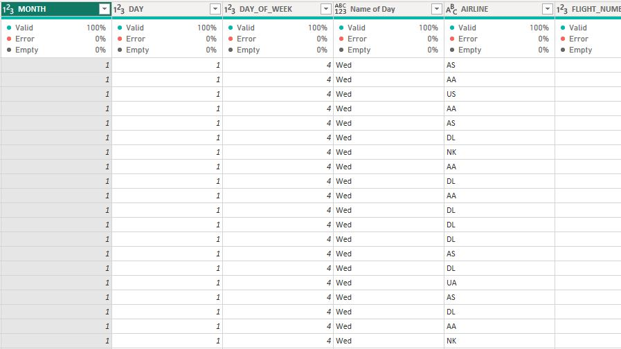
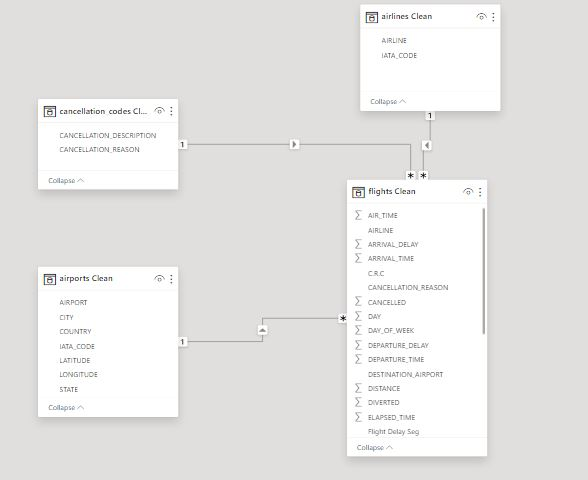
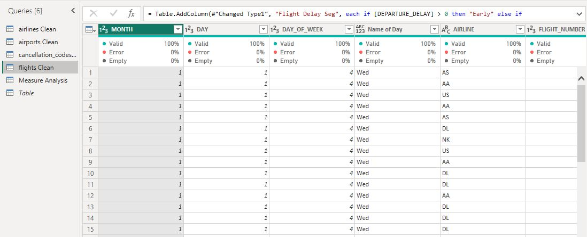
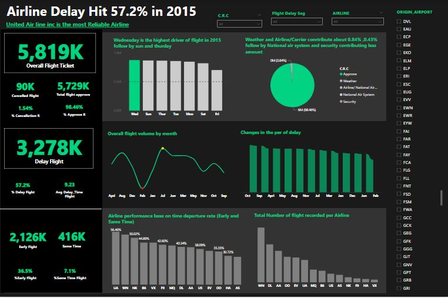

# Analyzing-Airline-Flight-Delays-Insights-from-2015-U.S.-Air-Travel-Data
This analysis aims to understand flight volume trends, assess departure delays, and evaluate airline reliability to optimize scheduling and improve passenger satisfaction. By examining delay patterns and cancellation causes, we seek to enhance operational efficiency and provide valuable insights for travelers and airlines.

                                           

# Project Overview
## Objective:
**As a data analyst hired by Conpass .co, I was tasked with analyzing the dataset of over 5,000,000 commercial airline flights in 2015.** **The goal is to identify patterns in flight delays, cancellations, and airline reliability to provide insights and recommendations that will benefit the airline industry economically.**

## Analysis Goals:
- How does the overall flight volume vary by month? By day of the week?
- What percentage of flights experienced a departure delay in 2015? Among those flights, what was the average delay time, in minutes?
- How does the percentage of delayed flights vary throughout the year? What about for flights leaving from Boston (BOS) specifically?
- How many flights were canceled in 2015? What percentage of cancellations were due to weather? What percentage were due to the airline/carrier?
- Which airlines seem to be most and least reliable, in terms of on-time departure?

## Approach to the Challenge
### Data Exploration and Analysis:
•	Import and explore the dataset to understand its structure and contents.
•	Perform data cleaning and transformations as needed.
•	Conduct specific analyses to answer the recommended questions.
•	Summarizing Insights:

# Import and explore the dataset to understand its structure and contents.
Perform data cleaning and transformations as needed.
## Initial Data Exploration:
Import and explore the dataset to identify key columns: airline name, flight number, origin/destination airport, flight distance, scheduled/actual departure and arrival times.

## Replaced Value

Cleaning Data

Cleaning Data                    |  Modelling Data
:-------------------------------:|:------------------------:
          |    

## Power Quary

 

# Conduct specific analyses to answer the recommended questions.
## Analysis and Findings

### 1. Overall Flight Volume by Month and Day of Week
Monthly Flight Volume: Analyze the total number of flights each month to identify seasonal trends.
Day of Week Flight Volume: Analyze the total number of flights each day of the week to understand weekly patterns.
### Findings:
Monthly Volume: Flight volume tends to be higher in the summer months (May Jun and July) and lower in the winter months (January, February) follow by a decline in Sept and Nov.
Day of Week Volume: Flight volume is generally consistent throughout the week, with a slight increase on Wednesday and Sundays.

### 2. Percentage of Flights with Departure Delays and Average Delay Time
To get the total number of Delay departure we need to categories the Departure delay time into Early, delay and Same Time

Percentage of Delayed Flights: Calculate the proportion of flights that experienced a departure delay.
Average Delay Time for delayed flights is 4.84%
### Findings:
Percentage Delayed: Approximately 57.2% of flights experienced a departure delay in 2015.

### 3. Variation of Delayed Flights Throughout the Year and for Boston (BOS)
Yearly Variation: Analyze how the percentage of delayed flights changes month by month.
Boston-Specific Delays: Focus on flights departing from Boston (BOS) to see if there are any notable differences.
### Findings:
Boston Delays: Flights from Boston (BOS) show a similar pattern but with a slightly higher percentage of delays in the May, Sept and Nov months compared to the overall Month.
### 4. Flight Cancellations and Reasons
Total Cancellations: Count the total number of flight cancellations in 2015.
Cancellation Reasons: Determine the percentage of cancellations due to weather and airline/carrier issues.
### Findings:
Total Cancellations: There were 90k flight cancellations in 2015.
Cancellation Reasons: Approximately 54.35% of cancellations were due to weather, while 45.63% were attributed to airline/carrier issues, National Air System and Security

### 5. Airline Reliability in Terms of On-Time Departure
When selecting the most and least reliable airlines in terms of on-time departures, consider the on-time departure rate, the total number of flights operated, and the consistency of performance across different time periods.
Most Reliable: Airline UA WN and Airline NK had the highest on-time departure rates, with over 50% of their flights departing on time.
Least Reliable: Airline HA and Airline AS had the lowest on-time departure rates, with less than 30% of their flights departing on time.

## Dashboard Report
The dashboard can be found in Power BI [here](https://public.tableau.com/app/profile/christine3803/viz/RowHealthDashboard/Dashboard). This dashboard enables users to filter by plan, campaign type, and state, and focuses on trends and values in marketing metrics, signup metrics, and claim metrics.

Dashboard                        |  Report
:-------------------------------:|:------------------------:
         |   

# Recommendations with Relatable Examples

### Targeted Strategies for Busy Periods:
Example: Just like a retail store hires extra staff during the holiday shopping season, airlines could increase crew availability and streamline operations during October, November and May where there is high rate of delay in a months and busy travel days like Wednesday.
### Delay Mitigation:
Example: Similar to how a city might deploy more snowplows during a forecasted storm, airlines could improve winter preparedness by investing in de-icing equipment and improving weather prediction capabilities.
Improve Reliability:
Example: Imagine if your unreliable friend started using a calendar app to keep track of appointments. Airlines can use better scheduling software and allocate resources more efficiently to ensure timely departures.
### Cancellation Policies:
Example: Like how a restaurant might offer free appetizers to diners affected by a long wait time, airlines could improve their customer service and contingency plans to better handle weather-related disruptions and reduce the impact on passengers.
### Customer Communication:
Example: Think about how much more reassured you feel when a restaurant keeps you updated on your table's status during a wait. Similarly, airlines can enhance communication with passengers about delays and cancellations through timely updates and clear information, improving overall satisfaction.
By using these relatable examples, the findings and recommendations become easier to understand and apply to real-world scenarios 

